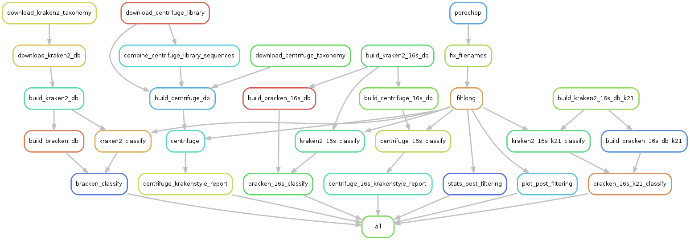

# Analysis



# Internal usage of analysis
These instructions are for if you have access to the `ebi-cli` cluster.  

## Installation

### Singularity
The first dependency is [`singularity`](https://www.sylabs.io/singularity/) which is a program for building and running containers. This package is installed on all worker nodes on the EBI cluster so you don't need to worry about installing it.  

### Python dependencies
The pipeline requires the python package [`snakemake`](https://snakemake.readthedocs.io/en/stable/) - which require python3. It is the package which runs and coordinates the analysis pipeline.
There are multiple ways of installing this package. Three will be presented here using `pip`, [`conda`](https://conda.io/en/latest/) and using the virtual environment tool [`pipenv`](https://pipenv.readthedocs.io/en/latest/).  

```sh
# using pip
pip3 install snakemake
# using pipenv
# if you dont have pipenv
pip3 install --user pipenv
# the following installs requirements and creates virtual env
cd /hps/nobackup2/research/stegle/users2/lurban/puntseq/public/analysis
pipenv install
# activate the virtual environment
pipenv shell
```

The instructions below will assume you are using the `pipenv` virtual environment for your `snakemake` installation.  

*NOTE: Make sure to activate the virtual environment whenever you start a new session.*  

## Setup

### Data
Any samples which you would like to run through the pipeline need to be put in a specific directory structure. Within the `analysis/` directory there is a directory called `data/`. Unsurprisingly the data goes in here. You should create a directory under `data/` with a name unique to the nanopore run. For example, we have `april`, `june`, and `august`. Under this directory you should create a directory called `basecalled`. Within that directory you place the fastq file to be analysed. The file must be `gzip`ed and be named `<run>_all_passed.fastq.gz`. So for `april` we name the file `april_all_passed.fastq.gz`.

### Config
In `analysis/` you will find a file called [`config.yaml`](https://github.com/d-j-k/puntseq/blob/master/analysis/config.yaml). This contains some global variables and also the names of runs and sample IDs. If you add a new run directory (i.e `september`) then you need to add it to the key `runs` within the config file. Aside from this you shouldn't need to change anything in this file unless you want to change some fixed parameters for a component of the pipeline.

### Cluster config
In `analysis/` you will find a file called [`cluster.yaml`](https://github.com/d-j-k/puntseq/blob/master/analysis/cluster.yaml). This contains configurations for `snakemake` to be able to submit jobs on the LSF cluster. The only time you would need to change something in here is if you add a new rule to the `snakemake` pipeline (in this case just copy the layout of the other rules) or if a job is killed for hitting it's memory limit (increase `memory` and the memory units in `resources`).  
*NOTE: The memory attribute in this file is in Mb units.*

## Run

To run the pipeline you just need to run a simple script.

```sh
cd /hps/nobackup2/research/stegle/users2/lurban/puntseq/public/analysis
# activate virtual environment if needed
pipenv shell
# submit
bash scripts/submit_lsf.sh 
```

Simples 🤘

## Debugging
All log files will be deposited in the the `analysis/logs` directory. Each rule will generate 3 log files. One with the `stderr` of the program it is running (file wildcard `.log`), one with the `stderr` of the cluster job running the rule (file wildcard `cluster_*.e`), and one containing the `stdout` of the cluster job (file wildcard `cluster_*.o`). Check the last entry in the `*.o` file to find out of the job completed successfully or whether it hit a memory limit. Check the `*.e` file for issues relating to `snakemake` job submission. And check the `*.log` file for any issues relating to the program itself.
